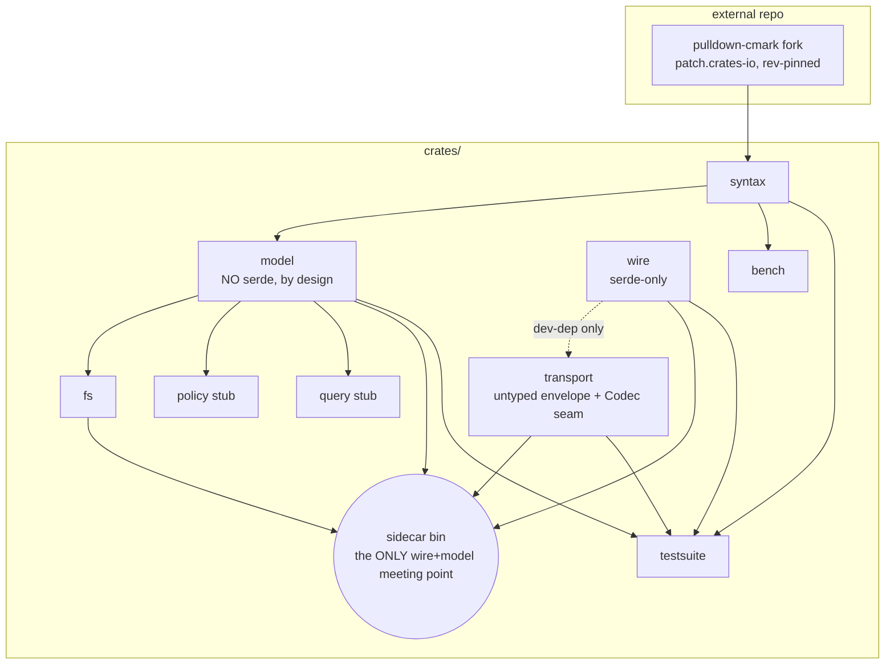

# meridian-rs — `candidate/laws-as-crates`

Skeleton-workspace candidate, rust-analyzer school: **crate boundaries make the
three laws unbreakable by construction.** Rival: `candidate/collapse-first`
(cargo/tokio school). Binding vision, design doc, and shared-ground resolutions:
`main`'s README pointer + session `18-02-meridian-rs/results/meridian-rs-crate-architecture.md`.

## Thesis

This codebase will be grown by agents at agent speed, and the vision exists
because a 5-minute workaround costs 5 weeks — so the laws must be cheaper to
follow than to route around, which only compile errors achieve. Here the three
laws are dependency edges: `model`'s public types carry no serde derives, so the
wire cannot leak inward; `wire` is serde-only, so nothing Go-facing exists
beyond it; `sidecar` is the single crate that sees both, so the entire
Rust↔Go bridge is one thin auditable binary; `syntax` is the only crate touching
the pulldown fork, so fork churn is a one-crate event. Meridian's own history is
the evidence for boundaries-by-construction: six regex grammars that "agree by
discipline," a shadow span-arithmetic module, and two silent data-loss bugs are
what module discipline delivers at maturity. rust-analyzer proves the school at
scale ("only one crate knows about LSP"; ide types "not serializable by
design"), and its lsp-server transport — untyped envelope, types swapped with
zero transport changes — is transcribed here as the `wire`/`transport` split.
Rungs 5–6 exist as stub crates from day one: additivity (constraint 4) is shown
as code, not promised in prose — new rungs add leaf crates or match arms, and
nothing shipped ever splits.

## Crate charters

| Crate | Charter |
|---|---|
| `syntax` | One pure function: markdown bytes → dialect node list with byte-exact spans — the only crate that touches the pulldown-cmark fork |
| `model` | The in-memory world model: governed node tree (kind/span/node_rev/hpath), resolve, CAS-splice validation, Merkle roots — deliberately non-serializable |
| `fs` | Disk truth in, atomic splices out: read/walk/watch feeding the model; tmp+fsync+rename splice execution |
| `wire` | The frozen wire vocabulary: path/span/node_rev/root + op/request/response/error types (serde-only, zero I/O) — the only Go-visible surface |
| `transport` | Untyped NDJSON message envelope + codec seam (lsp-server pattern): knows framing, never meaning |
| `policy` | Rung-6 policy engine stub: compile rulesets-as-data, evaluate assertions under declared budgets, authorize I3-shaped writes |
| `query` | Rung-5 corpus reads stub: backlinks, board queries, span-exact rename planning — borrows the model's index, applies nothing |
| `sidecar` (bin) | Thin NDJSON stdin/stdout binary — the only place wire and model meet |
| `testsuite` | Consolidated integration-test member carrying the frozen GT pack as data — no library code |
| `bench` | Criterion benches (corpus sweep, per-assertion p99 enforcement) — out of default-members |

Every charter fits one line (quality gate held — no two-line charters needed).
Each crate's `lib.rs` doc states charter, owns/never-does, its share of the
three laws, and which rung lands what.

## Crate graph

(`policy`/`query` take the corpus index as a borrowed capability parameter from
`model` — no policy→query edge; siblings over model.)

## Axis positions

- **A (granularity): fine** — THE candidate axis; this branch is the
  rust-analyzer school position argued above. Ten crates now, because a binary
  product's internal boundaries are free and each one carries a law.
- **C (wire evolution): types/transport split** — `wire` is the serde-only
  vocabulary crate; `transport` keeps the envelope untyped
  (`Request/Response/Notification` + `serde_json` maps, lsp-server verbatim)
  behind a `Codec` trait with `NdjsonCodec` first. `wire` appears in
  `transport` only as a dev-dependency (the typed/untyped agreement test).
  NDJSON→JSON-RPC graduation = a second `Codec` impl, one crate touched.
- **E (write authorization): position (a)** — `policy::authorize` evaluates
  I3-shaped rules-as-data, verdict returned on the wire; Go pre-authorizes
  actors and passes actor claims in as data. Full argument in `policy`'s crate
  doc: I3 rules are hpath/section-shaped, which is exactly the selector
  machinery the rung-6 engine owns; pushing them to Go either duplicates that
  engine or degrades I3 to path-only rules.
- **B, D (shared ground, not axes):** fork via `[patch.crates-io]` + rev pin
  (Zed mode — the pinned `obsidian` HEAD builds; repin with an upstream-PR
  comment per bump); `resolver = "2"`, `[workspace.package]` with
  `publish = false`, internals `0.0.0`, `{path, version = "0.0.0"}` deps, one
  real product version on `sidecar` (0.1.0).

## What this candidate risks — and why it accepts it

**The risk is premature-split cost** (tokio's 43-crates lesson: boundaries that
turn out wrong are expensive to walk back, and RFC 1318 collapsed them). Ten
crates on day one means every cross-cutting change touches more `Cargo.toml`s,
seam signatures calcify before implementations test them, and a wrong
syntax/model split would be a rename-and-reshuffle — exactly what constraint 4
forbids after shipping. Accepted because the tokio lesson is a *library*
lesson: its crate boundaries were user-visible semver surfaces; ours are free
internal structure in a never-published binary product (wasmtime/deno shape),
where a wrong boundary costs a refactor, not an ecosystem migration. Against
that reversible cost stands this stack's actual failure mode — law erosion
under agent-speed development, already exhibited at maturity by meridian's six
agreeing-by-discipline grammars. This candidate buys law enforcement with
compile errors and pays in `Cargo.toml` count; the rival buys low ceremony and
pays in review vigilance. That trade is the decision ZT is being asked to make.

## Relocation fit

Stream G's rung-1 sidecar (`parser-bench/lanes/rust-sidecar`, wire-contract-v1
implementation) is real code that relocates into the chosen candidate. Mapping
onto THIS candidate's seams:

| Sidecar piece | Destination here | Fit |
|---|---|---|
| `../rust-pulldown/src/lib.rs` — extraction core (`extract`, `Node`, span laws, 14 unit tests) | `syntax` (event/span extraction + post-passes) **and** `model` (tree assembly) **and** `sidecar` (`text_prefix_16b` + wire-node projection) | ⚠ **Awkward: three-way mid-file split.** The lane's `extract()` parses and emits wire-shaped flat nodes in one pass; this candidate forbids that edge (model non-serializable, syntax wire-blind). The prefix computation needs raw bytes *and* wire shape, so it lands in `sidecar`, away from the parse loop it lives in today. |
| `src/lib.rs` — framing + ops + error envelope | `wire` (op/error/node types) **and** `transport` (frame loop, codec) | ⚠ **Mid-file split, clean seam.** One file becomes two crates, but the cut line (types vs framing) is exactly the lsp-server boundary the file was written toward; the golden tests already treat them separately. |
| `src/main.rs` — arg parsing + stdin/stdout wiring (~50 lines) | `sidecar` bin | ✓ Clean move; this skeleton's `main.rs` already has its shape. |
| `tests/golden/*.pairs.ndjson` + `tests/fixtures/` | `testsuite` (`wire_golden` module + data files) | ✓ Clean move; pairs files are raw wire lines, consumable as-is. |

Honest reading: the flagship piece (extraction core) relocates *awkwardly* —
its one-pass parse-to-wire shape is precisely what this candidate exists to
forbid, so relocation here is a real refactor (split three ways), not a move.
The rival candidate absorbs it nearly verbatim. That is genuine evidence
against this branch, weighed against what the forbidden edge buys: under
collapse-first, the lane's shape — wire types reaching into the parse loop —
remains legal forever, and it is the exact shape law 3 exists to prevent.

## Skeleton deviations & notes (stated reasons)

- **`policy` has no YAML dependency yet:** ruleset parsing is in-charter, but
  the YAML library choice is a rung-6 implementation decision; pinning it in a
  skeleton would be decision-by-scaffold. Placeholder type + this note instead.
- **`root`/`guard` (rung 3) wire shapes** come from the vision ladder; the wire
  contract does not sketch them yet. They are in `wire`'s enums as
  loudest-marked sketches so the rung-3 additivity claim is visible as code.
- **Wire contract is in revision round 1** (leader's gate correction): enums
  match the current contract file (integer `id`, prefix-16b law, `[A-Za-z0-9_-]+`
  block-id charset, kind-ordinal sort tiebreak already reflected); post-freeze
  deltas get a re-verify pass after the branch lands.
- **`transport::NdjsonCodec` and two tests are implemented, not stubbed** — the
  codec is ~25 lines and the typed/untyped agreement test is the seam's proof;
  everything else is `todo!()` signatures.
- **`testsuite` carries the 10-file GT pack** (+ sources) verbatim from the
  frozen parser-bench pack; the 206-file corpus and 10 MB adversarial monsters
  stay in parser-bench (bench fixtures, not ground truth). Provenance + frozen
  manifest sha: `crates/testsuite/data/gt/PROVENANCE.md`.
