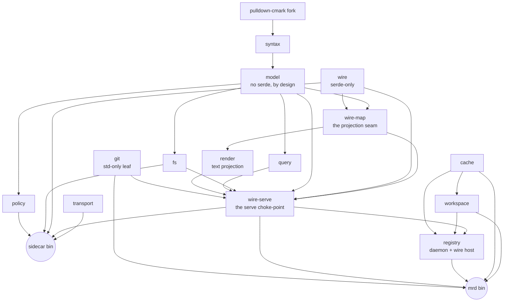

# meridian-rs

A Rust engine for a governed Markdown workspace. `meridian-rs` reads an
Obsidian-flavored Markdown vault into an in-memory world model, serves
byte-exact section reads and CAS-guarded batch edits, and emits change deltas
— all over a frozen NDJSON wire contract. It ships two binaries: `sidecar`, the
stdin/stdout process a host daemon speaks to, and `mrd`, the workspace CLI that
resolves a directory's identity, manages the on-disk cache, and runs the
registry daemon.

## What it is

- **A sidecar, not an app.** `sidecar` reads one JSON request per line on stdin
  and writes one response per line on stdout; logs go to stderr. A host process
  (e.g. a Go daemon) owns policy, identity, and orchestration and drives the
  sidecar for parsing, reads, edits, and change notifications.
- **Span-exact and clobber-safe.** Reads and writes address sections by
  structure (heading path, block anchor, frontmatter key), never by client-
  supplied byte offset. Edits are content-addressed: a node-grain or world-grain
  revision guard refuses a stale write instead of corrupting it.
- **A frozen contract.** The Go-visible surface is wire-contract-v2 (see
  `docs/`), frozen — changes are additive amendments, never silent breaks.

## Crates

| Crate | Charter |
|---|---|
| `syntax` | Markdown bytes → dialect node list with byte-exact spans; the only crate that touches the pulldown-cmark fork |
| `model` | The in-memory world model: governed node tree (kind/span/rev/hpath), resolve, CAS-splice validation, Merkle roots — deliberately non-serializable. Also content identity: the `fp1.…` fingerprint token, its verify verdict, and the one reason-carrying drift-color model |
| `fs` | Disk truth in, atomic splices out: read/walk/watch feeding the model; tmp+fsync+rename splice execution |
| `wire` | The frozen wire vocabulary: path/span/node_rev/root + op/request/response/error types (serde-only, zero I/O) |
| `wire-map` | The named model→wire projection seam: tree-flatten + prefix window + node ordering, as a tested library function |
| `git` | The git plumbing organ: shell-out blob object ids, the eager `-w` write, and object reachability against a repo handle — git owns content-addressing, the engine never computes an oid. A `std`-only leaf |
| `receipt` | The receipt family: the persisted outcome-as-fact line committed in the same batch as the edit, the append-only journal + forgery detector, the anchor freshness and blob three-state axes, and the ephemeral read-mint ledger |
| `transport` | Untyped NDJSON message envelope + codec seam (knows framing, never meaning) |
| `policy` | Ruleset compilation and assertion evaluation under declared budgets; produces edit-time verdicts and the blocking armed-plane gate |
| `query` | Corpus reads: backlinks, board queries, span-exact rename planning — borrows the model's index |
| `wire-serve` | The shared typed edge: strict decode, read arms incl. the composed `read`, the `splice → commit` write choke-point, the v3 projection — one implementation, two hosts |
| `render` | The compiled-in render plane: `Renderer` trait + node-grain walker producing the `readText` text projection, with the block-elision and claim-link decoration hooks — decorations arrive as data, never as a dependency edge |
| `lock` | The `meridian-lock` fenced-block format: canonical writer/reader, engine sole-writer; owns the reserved `meridian-*` namespace predicate |
| `effects` | The effect kernel: pure Starlark evaluation — rules in, effect descriptors out; zero I/O, advisory-only |
| `run` | The mrd-local run plane: plan/execute under the workspace run lock |
| `realise` | The realise engine: observe → check → apply per claim, on the run plane |
| `check` | The check engine: the pure READ verb of the reconciliation loop |
| `view` | The DuckDB view organ: a write-only leaf projecting the warm corpus into a disposable, fingerprint-stamped file; also the lock-aware read face that renders each `meridian-lock` pin's drift color through `model`'s one computer |
| `preset` | Presets + session birth: def-pinned convention floor; `unfold`/`new` materialize through the guarded create |
| `sidecar` (bin) | The per-workspace NDJSON stdin/stdout host — wiring only; dispatches through `wire-serve` |
| `workspace` | Workspace identity: the discovery ladder (env → `.meridian.toml` → git root → bare), canonicalization, and the deny-ceiling predicate — pure filesystem functions, writes nothing |
| `cache` | The central hashed cache drawer: addressing, atomic sentinel registration, corrupt-is-a-miss probing, last-use stamping, and the Cargo-grade GC sweep |
| `registry` | The daemon-held workspace registry (watchman model): a unix-socket NDJSON RPC server + client, first-writer-wins registration, atomic state file, idle-reap |
| `mrd` (bin) | The workspace CLI wiring `workspace`/`cache`/`registry` into the settled verbs: `init`, `unregister`, `resolve`, `cache ls`, `cache clean`, `daemon` |
| `testsuite` | Consolidated integration-test member carrying the frozen ground-truth pack as data |
| `perfsuite` | Perf harness: deterministic corpora, a claims registry, and criterion benches (out of default-members) |

## Architecture graph



Both hosts — the per-workspace `sidecar` and the resident `registry` daemon —
dispatch through the ONE `wire-serve` typed edge ("one served implementation,
two hosts"); `mrd` is a local client of the same edge. The
`workspace` / `cache` / `registry` / `mrd` cluster remains the CLI foundation:
identity, storage, and the daemon-held registry. The dependency edges enforce
the three laws — see `docs/laws.md`.

## Build & run

```sh
cargo build            # default members (perfsuite excluded)
cargo test --workspace # the full suite
cargo run -p sidecar -- <workspace-root>   # serve one vault on stdin/stdout
cargo run -p mrd -- init                   # mark the cwd as a workspace
cargo run -p mrd -- cache ls               # list the on-disk cache drawers
```

The sidecar speaks NDJSON: one request object per line in, one response per
line out. A minimal exchange:

```
{"id":1,"op":"hello","proto":1}
{"id":2,"op":"toc","path":"notes/plan.md"}
```

## Documentation

Start here, then follow the file that matches your role:

| Doc | Read it for | Start here if you are… |
|---|---|---|
| `docs/wire-contract-v2.md` | The frozen NDJSON contract: ops, shapes, guards, deltas, errors | integrating a host daemon against the wire |
| `docs/wire-contract-v3-amendment.md` | The live v3 rev: the `root`→`fingerprint` rename, the composed `read`, and the stage-2 attestation surface (`splice.pin`, the read-mint receipt, `anchors[]`, the `@fp` grammar, the error-code additions) | writing a v3 client, or pinning content |
| `docs/wire-contract-v2-colors-amendment.md` | The color law: the pin-axis grey enumeration, the anchor axis, and the composed three-axis legend | rendering or reading drift state |
| `docs/node-rev-merkle-spec.md` | How node revisions and workspace roots are computed and bound | implementing or verifying the rev/root hashing |
| `docs/laws.md` | The three architecture laws and per-crate charters | contributing Rust code to the engine |
| `docs/status.md` | Current build state: armed capabilities, test baseline, perf verdicts | checking what works today |
