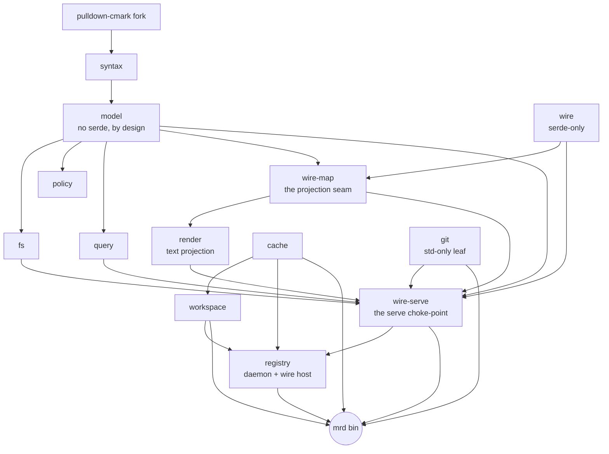

# meridian-rs

A Rust engine for a governed Markdown workspace. `meridian-rs` reads an
Obsidian-flavored Markdown vault into an in-memory world model, serves
byte-exact section reads and CAS-guarded batch edits, and emits change deltas
— all over a frozen NDJSON wire contract. It ships one binary: `mrd`, the
workspace CLI that resolves a directory's identity, manages the on-disk cache,
reads and writes pages, attests them with pins, and runs the registry daemon —
whose unix socket is the one wire door (`docs/wire-contract.md` §3.3).

## What it is

- **An engine behind one socket, not an app.** The registry daemon reads one
  JSON request per line on its unix socket and writes one response per line;
  logs go to stderr. A client process (an MCP server, an editor plugin, a
  script) owns policy, identity, and orchestration and drives the socket for
  parsing, reads, edits, and change notifications.
- **Span-exact and clobber-safe.** Reads and writes address sections by
  structure (heading path, block anchor, frontmatter key), never by client-
  supplied byte offset. Edits are content-addressed: a node-grain or world-grain
  revision guard refuses a stale write instead of corrupting it.
- **A standing wire contract.** The client-visible surface is
  `docs/wire-contract.md` (accurate design; **docs first**, code may lag).
  There is no v2/v3 stack to learn.

## Build & test

Rust 1.96 or newer (`rust-version` in `Cargo.toml`). The workspace pins a
`pulldown-cmark` fork via `[patch.crates-io]` and vendors DuckDB through the
`bundled` feature, so the first build compiles the DuckDB amalgamation — expect
several minutes and a few GB under `target/`.

```sh
cargo build --locked                 # default members (perfsuite excluded)
cargo test --workspace --locked      # the full suite
cargo clippy --workspace --all-targets --locked -- -D warnings
cargo fmt --all --check
cargo deny check                     # licenses, sources, the one-copy fork law (deny.toml)
```

`just` recipes wrap the same commands (`just build`, `just test`, `just install`
puts `mrd` in `~/.local/bin`).

## Run

```sh
cargo run -p mrd -- init                   # declare the cwd as a workspace root
cargo run -p mrd -- status                 # the composed status line
cargo run -p mrd -- read notes/plan.md     # a composed read (daemon or in-process)
cargo run -p mrd -- cache ls               # list the on-disk cache drawers
cargo run -p mrd -- daemon                 # run the registry daemon in the foreground
```

`mrd help` lists every verb; `docs/status.md` describes each one.

The daemon socket speaks NDJSON: one request object per line in, one response
per line out (`echo … | nc -U "$SOCKET"` works — pipe debuggability is a
contract property, `docs/wire-contract.md` §3.1). A minimal exchange:

```
{"id":1,"op":"hello","proto":1}
{"id":2,"op":"toc","path":"notes/plan.md"}
```

## Crates

| Crate | Charter |
|---|---|
| `timing` | The timing instrument: `MRD_TIMING` resolved once per process, one `mrd-timing` line per completed phase; `std`-only, silent when off |
| `addr` | The agent-plane address `[root:]path[#selector]` as a fallible type; `std`-only, upstream of `syntax` |
| `syntax` | Markdown bytes → dialect node list with byte-exact spans; the only crate that touches the pulldown-cmark fork |
| `model` | The in-memory world model: governed node tree (kind/span/rev/hpath), resolve, CAS-splice validation, Merkle roots — deliberately non-serializable. Also content identity: the `fp1.…` fingerprint token, its verify verdict, and the one reason-carrying drift-color model |
| `fs` | Disk truth in, atomic splices out: read/walk/watch feeding the model; tmp+fsync+rename splice execution |
| `config` | The `MERIDIAN.md` plane: the one entry point parsed as content (a rev and a fingerprint like any page), fail-loud with no partial mount table |
| `wire` | The standing wire vocabulary: path/span/node_rev/fingerprint + op/request/response/error types (serde-only, zero I/O) |
| `wire-map` | The named model→wire projection seam: tree-flatten + prefix window + node ordering, as a tested library function |
| `git` | The git plumbing organ: shell-out blob object ids, the eager `-w` write, and object reachability against a repo handle — git owns content-addressing, the engine never computes an oid. A `std`-only leaf |
| `receipt` | The receipt family: the persisted outcome-as-fact line committed in the same batch as the edit, and the anchor freshness and blob three-state axes |
| `transport` | Untyped NDJSON message envelope + codec seam (knows framing, never meaning) |
| `policy` | Ruleset compilation and assertion evaluation under declared budgets; produces edit-time verdicts and the blocking armed-plane gate |
| `query` | Corpus reads: backlinks, board queries, span-exact rename planning — borrows the model's index |
| `wire-serve` | The shared typed edge: strict decode, read arms incl. the composed `read`, the `splice → commit` write choke-point — one implementation, one host |
| `render` | The compiled-in render plane: `Renderer` trait + node-grain walker producing the text projection, with the block-elision and claim-link decoration hooks |
| `lock` | The `meridian-lock` fenced-block format: canonical writer/reader, engine sole-writer; owns the reserved `meridian-*` namespace predicate |
| `effects` | The effect kernel: pure Starlark evaluation — rules in, effect descriptors out; zero I/O, advisory-only |
| `run` | The mrd-local run plane: plan/execute under the workspace run lock |
| `realise` | The realise engine: observe → check → apply per claim, on the run plane |
| `check` | The check engine: the pure READ verb of the reconciliation loop |
| `view` | The DuckDB view organ: a write-only leaf projecting the warm corpus into a disposable, fingerprint-stamped file; also the lock-aware read face that renders each `meridian-lock` pin's drift color |
| `preset` | Presets + session birth: def-pinned convention floor; `unfold`/`new` materialize through the guarded create |
| `workspace` | Workspace identity: the discovery ladder (env → `.meridian.toml` → git root → bare), canonicalization, and the deny-ceiling predicate — pure filesystem functions, writes nothing |
| `cache` | The central hashed cache drawer: addressing, atomic sentinel registration, corrupt-is-a-miss probing, last-use stamping, and the Cargo-grade GC sweep |
| `registry` | The daemon-held workspace registry (watchman model): a unix-socket NDJSON RPC server + client, first-writer-wins registration, atomic state file, idle-reap |
| `mrd` (bin) | The workspace CLI: `init`, `resolve`, `read`, `put`, `rm`, `pin`, `check`, `walk`, `status`, `rules`, `arm`, `run`, `script`, `sql`, `cache`, `daemon`, … (`mrd help`) |
| `testsuite` | Consolidated integration-test member carrying the frozen ground-truth pack as data |
| `perfsuite` | Perf harness: deterministic corpora, a claims registry, and criterion benches (out of default-members) |

## Architecture graph



The one wire host — the resident `registry` daemon — dispatches through the
one `wire-serve` typed edge ("one served implementation, one host"); `mrd` is a
local client of the same edge. The `workspace` / `cache` / `registry` / `mrd`
cluster is the CLI foundation: identity, storage, and the daemon-held registry.
The dependency edges enforce the three laws — see `docs/laws.md`.

## Documentation

Start with `docs/README.md`, then follow the file that matches your role:

| Doc | Read it for | Start here if you are… |
|---|---|---|
| `docs/README.md` | Docs-first process, standing corrections, inventory | start here |
| `docs/wire-contract.md` | The **only** wire constitution: ops, segments, fingerprint, receipts, refusal, … | integrating a client against the wire |
| `docs/node-rev-merkle-spec.md` | How node revisions and workspace fingerprints are hashed | implementing or verifying revs |
| `docs/laws.md` | Three architecture laws and per-crate charters | contributing Rust |
| `docs/run-plane.md` | The run plane: plan/execute, presets, session birth | working on `run` / `realise` / `preset` |
| `docs/status.md` | CLI / build snapshot (**descriptive** — not design authority over the contract) | what the binary exposes today |

Design changes land in `docs/` **before** code (`CLAUDE.md`).

## CI

CI runs on Woodpecker (`.woodpecker/ci.yaml`): fmt, clippy with `-D warnings`,
the full test suite, `cargo deny`, and a perfsuite smoke run; `main` pushes
publish an `mrd` binary keyed by commit and `v*` tags cut releases
(`docs/release.md`). The GitHub Actions workflows under `.github/workflows/`
are manual-only (`workflow_dispatch`).

## License

Licensed under either of

- Apache License, Version 2.0 ([LICENSE-APACHE](LICENSE-APACHE))
- MIT license ([LICENSE-MIT](LICENSE-MIT))

at your option.

Unless you explicitly state otherwise, any contribution intentionally submitted
for inclusion in the work by you shall be dual licensed as above, without any
additional terms or conditions.
