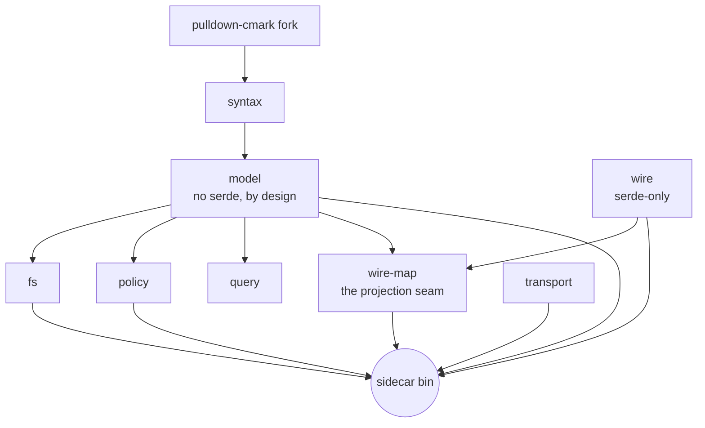

# meridian-rs

A Rust engine for a governed Markdown workspace. `meridian-rs` reads an
Obsidian-flavored Markdown vault into an in-memory world model, serves
byte-exact section reads and CAS-guarded batch edits, and emits change deltas
— all over a frozen NDJSON wire contract. It ships as one binary, `sidecar`,
the stdin/stdout process a host daemon speaks to.

## What it is

- **A sidecar, not an app.** `sidecar` reads one JSON request per line on stdin
  and writes one response per line on stdout; logs go to stderr. A host process
  (e.g. a Go daemon) owns policy, identity, and orchestration and drives the
  sidecar for parsing, reads, edits, and change notifications.
- **Span-exact and clobber-safe.** Reads and writes address sections by
  structure (heading path, block anchor, frontmatter key), never by client-
  supplied byte offset. Edits are content-addressed: a node-grain or world-grain
  revision guard refuses a stale write instead of corrupting it.
- **A frozen contract.** The Go-visible surface is wire-contract-v2 (see
  `docs/`), frozen — changes are additive amendments, never silent breaks.

## Crates

| Crate | Charter |
|---|---|
| `syntax` | Markdown bytes → dialect node list with byte-exact spans; the only crate that touches the pulldown-cmark fork |
| `model` | The in-memory world model: governed node tree (kind/span/rev/hpath), resolve, CAS-splice validation, Merkle roots — deliberately non-serializable |
| `fs` | Disk truth in, atomic splices out: read/walk/watch feeding the model; tmp+fsync+rename splice execution |
| `wire` | The frozen wire vocabulary: path/span/node_rev/root + op/request/response/error types (serde-only, zero I/O) |
| `wire-map` | The named model→wire projection seam: tree-flatten + prefix window + node ordering, as a tested library function |
| `receipt` | Receipt rendering: outcome-as-fact lines committed in the same batch as the edit |
| `transport` | Untyped NDJSON message envelope + codec seam (knows framing, never meaning) |
| `transport-proto` | Opt-in typed protobuf transport: `meridian.proto` + length-delimited framing |
| `policy` | Ruleset compilation and assertion evaluation under declared budgets; produces edit-time verdicts |
| `query` | Corpus reads: backlinks, board queries, span-exact rename planning — borrows the model's index |
| `sidecar` (bin) | The thin NDJSON stdin/stdout binary — the only place wire and model meet |
| `testsuite` | Consolidated integration-test member carrying the frozen ground-truth pack as data |
| `perfsuite` | Perf harness: deterministic corpora, a claims registry, and criterion benches (out of default-members) |

## Architecture graph



The dependency edges enforce three laws — see `docs/laws.md`.

## Build & run

```sh
cargo build            # default members (perfsuite excluded)
cargo test --workspace # the full suite
cargo run -p sidecar -- <workspace-root>   # serve one vault on stdin/stdout
```

The sidecar speaks NDJSON: one request object per line in, one response per
line out. A minimal exchange:

```
{"id":1,"op":"hello","proto":1}
{"id":2,"op":"toc","path":"notes/plan.md"}
```

## Documentation

Start here, then follow the file that matches your role:

| Doc | Read it for | Start here if you are… |
|---|---|---|
| `docs/wire-contract-v2.md` | The frozen NDJSON contract: ops, shapes, guards, deltas, errors | integrating a host daemon against the wire |
| `docs/node-rev-merkle-spec.md` | How node revisions and workspace roots are computed and bound | implementing or verifying the rev/root hashing |
| `docs/laws.md` | The three architecture laws and per-crate charters | contributing Rust code to the engine |
| `docs/status.md` | Current build state: armed capabilities, test baseline, perf verdicts | checking what works today |
